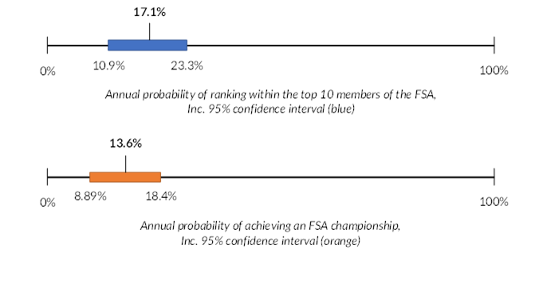

# Probability Modelling
---

We obtained an average 13.6% annual probability of winning the FSA Championship for our chosen team, with a 17.1% annual probability of ranking within the top 10 members of the FSA. This resulted in a 76.9% probability of winning the FSA Championship within 10 years, and a 60.8% probability of ranking within the top 10 members of the FSA within 5 years. The 95% confidence intervals for the annual probabilities are shown below.

These probabilities were obtained through running beta regression models dependent on player position and other pertinent player statistics, some of which are listed below:

* <b> Defense:</b> 'Minutes play divided by 90', 'Interceptions', 'Clearances' ...
* <b> Passing:</b> 'Minutes play divided by 90', 'Pass completion percentage (5 - 15 yards)', 'Passes that directly lead to a shot (assisted shots)' ...
* <b> Shooting:</b> 'Minutes play divided by 90', 'Shots on target percentage', 'Average distance, in yards, from goal of all shots taken' ...
* <b> Goalkeeping:</b> 'Minutes play divided by 90', '% Match with clean sheet (CS)', 'Penalty kick goal against/ penalty kick attempt' ...
